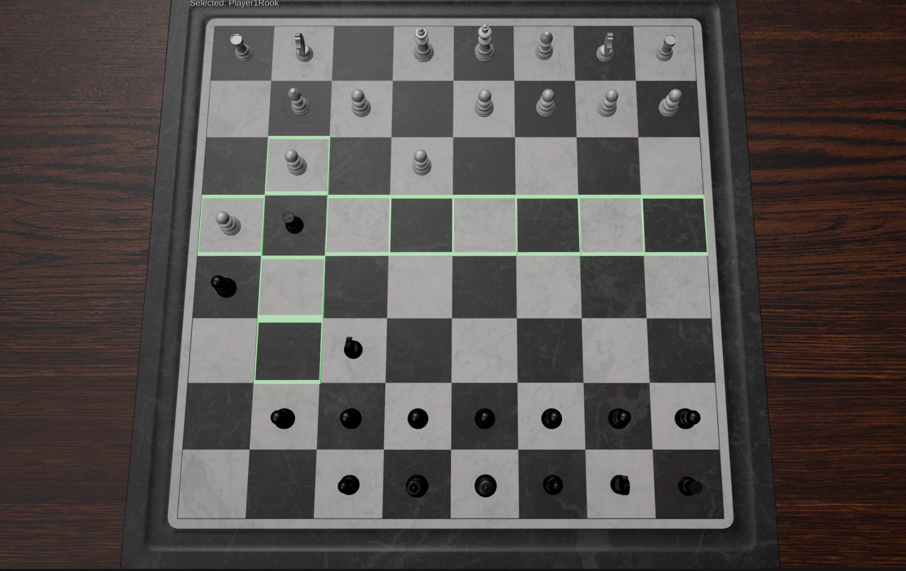
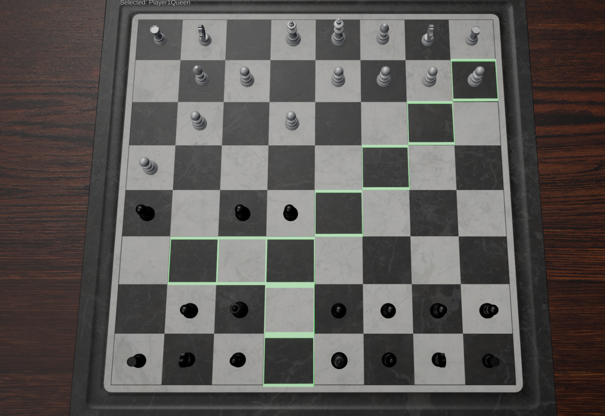
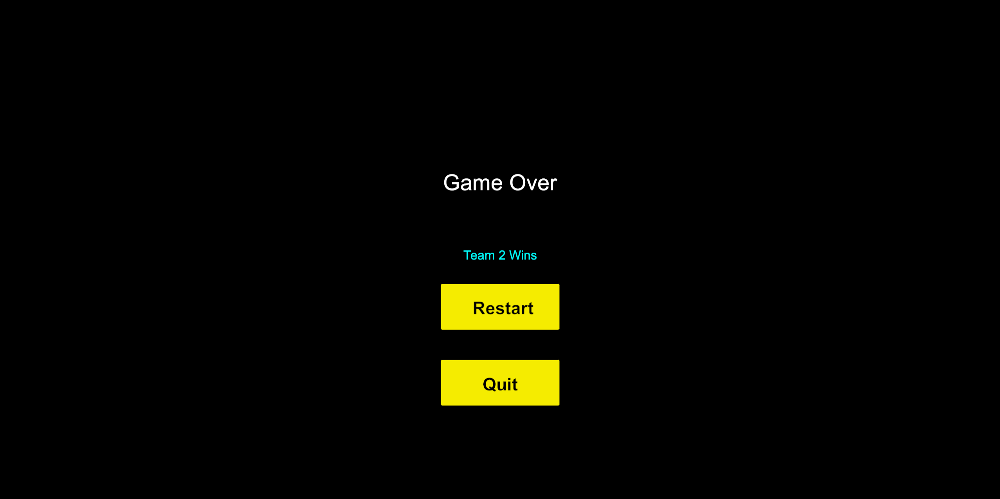

# Chess Game (Unity)

A complete Unity chess game

## Features
- Full chess logic (including check, checkmate, and stalemate)
- Simple, responsive UI
- Sound effects and SFX toggle
- AI and Local Multiplayer modes
## Controls 
- Mouse1: Select/Escape
- Escape: Menu
## How to play 
- Go to releases and download the builds.zip
- Unzip and run the .exe

## Screenshots	

  
  
  

